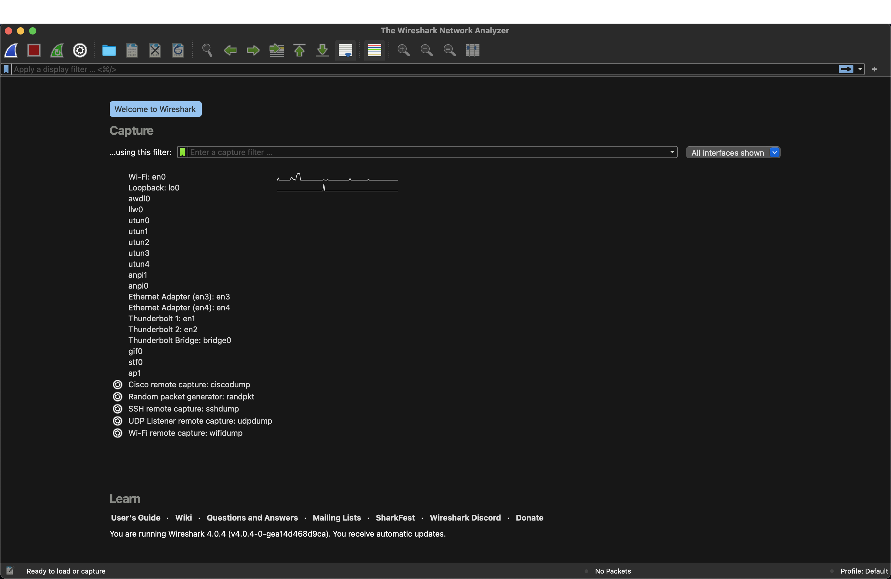
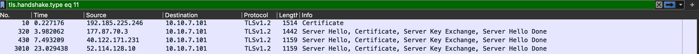
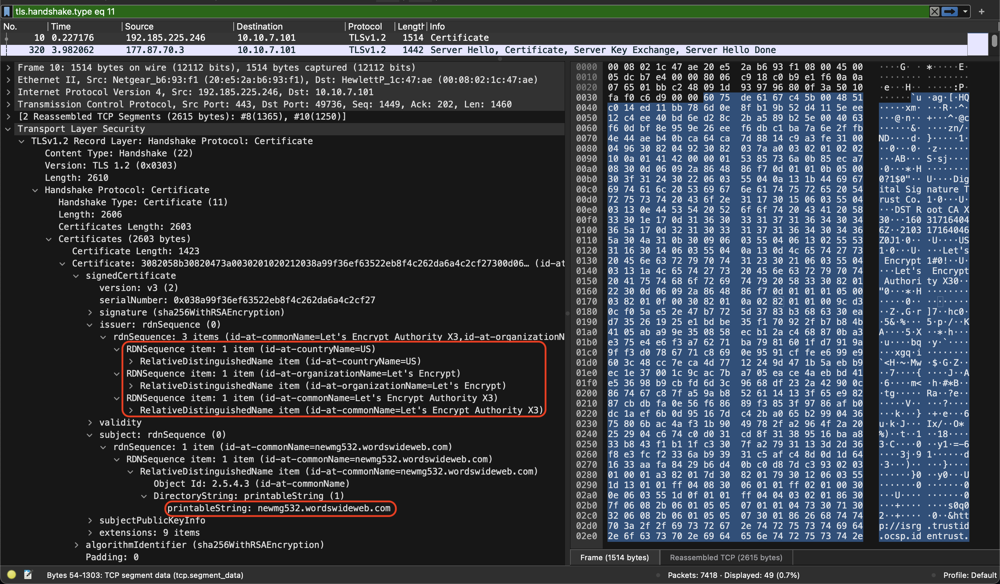

## Introduction
Wireshark is a network protocol analysis application which lets you see what's happening on a microscopic level on your/ clients network. Allows for the live capture 

### Uses: 
-   Network administrators use it to _troubleshoot network problems_
-   Network security engineers use it to _examine security problems_
-   QA engineers use it to _verify network applications_
-   Developers use it to _debug protocol implementations_
-   People use it to _learn network protocol_ internals



## Filtering:

### Message types
The below graph shows the handshake types which is used by TLS/SSL encryption. 
| | |
|---|---|
| Code | Description |
| 0 | HelloRequest | 
| 1 | ClientHello |
| 2 | ServerHello |
| 4 | NewSessionTicket |
| 8 | EncryptedExtensions (TLS 1.3 only) |
| 11 | Certificate |
| 12 | ServerKeyExchange |
| 13 | CertificateRequest |
| 14 | ServerHelloDone |
| 15 | CertificateVerify |
| 16 | ClientKeyExchange |
| 20 | Finished |

A digital certificate is used for SSL/TLS encryption of HTTPS traffic. When viewing a website using HTTPS, a certificate is sent by the web server to a client's web browser. Data from this digital certificate is used to establish an HTTPS connection. Certificates contain a website's public key and confirm the website's identity.

We can find this TLS handshake information within a PCAP file to identify what domain's the device has made contact with by filtering out all other information other than the TLS certificate by using "tls.handshake.type eq 11" will find any successful tls handshakes which have sent over their certifactes to the device found within the PCAP. 



By opening up the Transport Layer Security -> TLS -> Handshake Protocol -> Certificate -> signedCertificate you can view the who the issuer is and also what the domain name is by opening up the subject up. As shown in the below image which shows the fully expanded tree to gather the desired certifacte and the domain which the device has successfully connected to. 


You can also filter by certain TCP/UDP port to find more targeted set of information. tcp.port only looks at the TCP traffic and udp.port does exactly the same for UDP traffic. 
```
tcp.port == PORT NUMBER || udp.port == PORT NUMBER
```

Filtering for only http traffic or ClientHello handshakes over TLS while also not showing ssdp traffic from and to the web server. 
```
(http.request or tls.handshake.type eq 1) and !(ssdp)
```


### Further resources on WireShark
1. [Wireshark documentation](https://wireshark.org/docs/)
	1. [Single document](https://www.wireshark.org/docs/wsug_html/)
2. [PCAP file of Dridex infection](https://github.com/pan-unit42/wireshark-tutorial-Dridex-traffic)
3. 